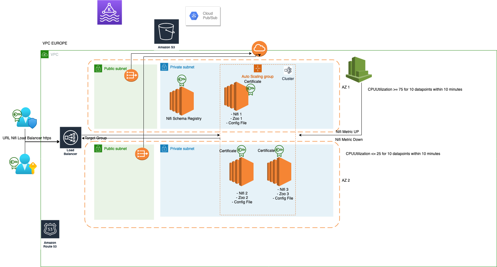

# RATP PreProd Nifi project : Infrastructure as Code

This project gathers all the infrastructure as code and configuration management scripts for the RATP Dev Nifi project

## Architecture overview

This  project is part of a real-time data processing platform in the cloud with a dynamic and resilient Nifi Apache cluster for data collection, 
Lambda Serverless with python for processing, AWS S3 for storage, ElasticSearch and Kibana (Opensearch) for data visualisation.

The project contains one network (VPC) and tow avialibility zone For the high availability
+ Each network is divided between a public subnet, directly accessible from internet, and a private subnet, isolated in ingress. 
+ The two subnet are connected by a NAT gateway, and the public subnet is connected to the Internet through a Internet gateway.
+ The private subnet of each "location" hosts the Nifi server, and the Nifi registry server.
+ Webservices that are needed by all locations (mostly CI/CD tools like Jenkins, Nexus) are made available on the public subnet of the corp
+ The private subnet of each location is connected with the local on-premises network of correspnding location through dedicated VPN

Schema of the whole architecture :



## Mandatory prerequisites for running

You will need to install a few tools to make use of the project.

### Ansible

Ansible is a tool for configuration management, that allows parallelized SSH connections to remote hosts.

Please check the Ansible documentation for [installation](https://docs.ansible.com/ansible/latest/installation_guide/intro_installation.html) 

### Terraform

Terraform is a tool for Infrastructure as Code, that allows to provision resources (like virtual machines) on almost all cloud providers.

Please check the Terraform documentation for [installation](https://learn.hashicorp.com/terraform/getting-started/install.html)

Be sure that the Terraform binary file is accessible through PATH variable, and that you downloaded version > 0.12

You can find detailed information about obtaining Terraform credentials for AWS [here](https://hackernoon.com/introduction-to-aws-with-terraform-7a8daf261dc0)

### SSM Manager 
AWS Systems Manager is a collection of capabilities to help you manage your applications and infrastructure running in the AWS Cloud. 
Systems Manager simplifies application and resource management, 
shortens the time to detect and resolve operational problems, and helps you manage your AWS resources securely at scale.

[here](https://docs.aws.amazon.com/systems-manager/latest/userguide/session-manager-working-with-install-plugin.html)

### Apache Nifi 

NiFi is a Java program that runs within a Java virtual machine running on a server.
The prominent components of Nifi are :

+ Web Server - the HTTP-based component used to visually control the software and monitor the events happening within
+ Flow Controller - serves as the brains of NiFi's behaviour. Controls the running of Nifi extensions and schedules allocation of resources for this to happen.
+ Extensions - various plugins that allow Nifi to interact with various kinds of systems
+ FlowFile repository - used by NiFi to maintain and track status of the currently active FlowFile Or the information that NiFi is helping move between systems.
+ Content repository - the data in transit is maintained here
+ Provenance repository - data relating to the provenance of the data flowing through the system is maintained here.
  our nifi version is => 1.13.2 [here](https://cwiki.apache.org/confluence/display/NIFI/Release+Notes#ReleaseNotes-Version1.13.2)

### Nifi Registry

Apache NiFi Registry—a subproject of Apache NiFi—is a complementary application that provides a central location for storage and management of shared 
resources across one or more instances of NiFi.

The first implementation of the Registry supports versioned flows. Process group level dataflows created in NiFi can be placed under 
version control and stored in a registry. The registry organizes where flows are stored and manages the permissions to access, create, 
modify or delete them.
### Apache ZooKeeper

Apache ZooKeeper is an open-source server for highly reliable distributed coordination of cloud applications.
It is a project of the Apache Software Foundation.

ZooKeeper is essentially a service for distributed systems offering a hierarchical key-value store, which is used to provide a distributed 
configuration service, synchronization service, and naming registry for large distributed systems.
ZooKeeper was a sub-project of Hadoop but is now a top-level Apache project in its own right.


## Quickstart

### Preparing credentials

You will need credentials for the Cloud Provider you choose.

Please go to the `~./aws` folder, use it for fulfilling your credentials associated with your Cloud account.
add your aws configuration in the nifi.tfvars 
Exemple (nifi.tfvars) : 
# aws profile (e.g. from aws configure, usually "default")
aws_profile = "nifi_dev"
aws_region  = "eu-west-1"

### Execution

Once the credentials are set, you can execute 

```
terraform apply -var-file="nifi.tfvars"
```

to create the infrastructure with Terraform, ssm manager, and ansible


## Project overview and structure

### Overview

The project is organized in two main parts :

- Infrastructure as Code, managed by Terraform
- Configuration Management, managed by Ansible and SSM Manager

### Infrastructure as Code

You define your hardware architecture in the file `projects nifi.tfvars` file.
Then, you can deploy it by executing file `"nifi.tfvars"` with specific argument :

```bash
terraform apply -var-file="nifi.tfvars"
```


The execution of Terraform will dump a `terraform_outputs.json`file in the folder `ansible/inventory`. This file contains many information about the hardware you just created, especially IP addresses.


### Detailed description

You can read the detailed description of the project's structure [here]//(./doc/detailed_description.md)

### Iac Guidelines

If you want to develop new features as Terraform modules, to edit an existing architecture or create a new one, you can use the [following guidelines](./doc/iac_guidelines.md) for understanding the structure of the IaC.

## Security management of the architecture

See detailed description of the security tools and policies [here]//./doc/security.md)


## Tips and tricks

###
## SSM Manager tunnels

To tunnel a ssm connection from your local machine to your private remote server through a SSM Manager, here is the command :
aws ssm start-session --target  <<instance-id>>   --profile <<Your aws profile>> --region  eu-west-1


### Using Terraforming

Terraforming allows to dump existing cloud infrastructures into Terraform state file

http://terraforming.dtan4.net/

### Installing Gitlab on AWS

https://docs.gitlab.com/ee/install/aws/

## SSM manager tunnels

To connect to your instance :
aws ssm start-session --target  <<instance-id>>   --profile <<Your aws profile>> --region  eu-west-1


